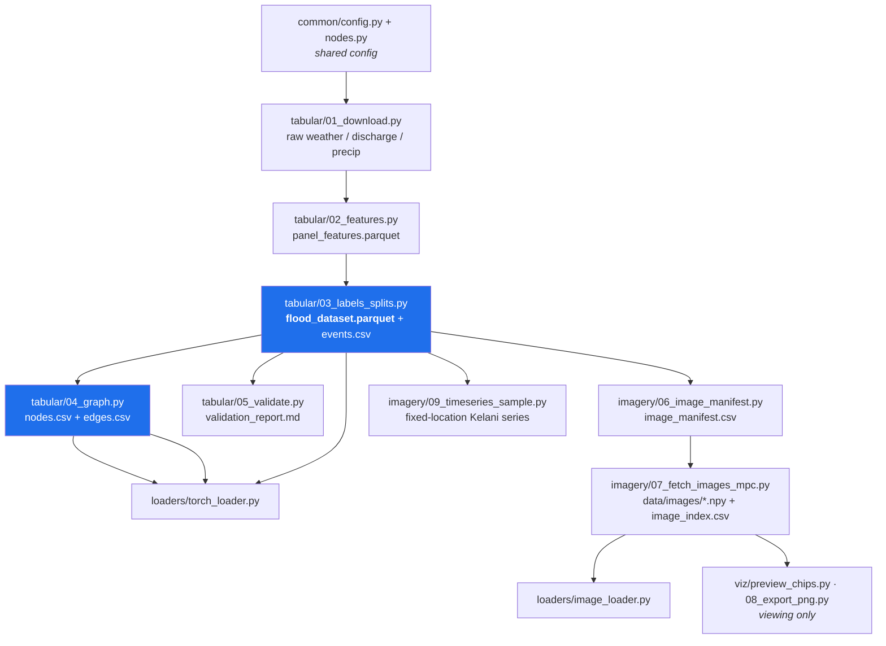

# `scripts/` — Pipeline Guide

Every script that builds the Sri Lanka multimodal flood dataset lives here,
grouped into folders by role. This file explains **what each script does, the
order to run them, and what each one produces.**

The dataset has two branches that share the same node network and flood labels:

- **Branch A — Tabular / graph** (rainfall, soil, river discharge → flood labels & a spatiotemporal graph). This is the *label engine*.
- **Branch B — Imagery** (Sentinel-1 SAR radar chips), labeled automatically by Branch A.

All outputs land in `data/raw/` (cached API downloads) and `data/processed/`
(analysis-ready tables). Nothing here needs an API key.

---

## Folder layout

```
scripts/
├── common/     shared config & the node network (imported by everything)
│   ├── config.py          central settings (dates, thresholds, splits, APIs)
│   └── nodes.py           the 51 river-monitoring nodes + topology
├── tabular/    Branch A — build the tabular dataset & graph
│   ├── 01_download.py     download raw reanalysis (weather / discharge / precip)
│   ├── 02_features.py     engineer features  -> panel_features.parquet
│   ├── 03_labels_splits.py labels/targets/events/splits -> flood_dataset.parquet
│   ├── 04_graph.py        river + spatial graph -> nodes.csv, edges.csv
│   ├── 05_validate.py     validate labels vs real floods -> validation_report.md
│   └── run_all.py         runs steps 02 -> 05 in order
├── imagery/    Branch B — Sentinel-1 SAR fetchers
│   ├── 06_image_manifest.py   decide which chips to fetch -> image_manifest.csv
│   ├── 07_fetch_images_mpc.py fetch chips -> data/images/*.npy, image_index.csv
│   └── 09_timeseries_sample.py fixed-location Kelani time series (alt. strategy)
├── loaders/    turn the dataset into model-ready tensors
│   ├── image_loader.py    pair SAR chips with tabular rows (NumPy)
│   └── torch_loader.py    spatiotemporal graph tensors (PyTorch / PyG)
└── viz/        viewers — NEVER train on these outputs
    ├── preview_chips.py   sample grids of chips -> docs/chips_*.png
    └── 08_export_png.py   export every chip to viewable PNGs
```

> **Paths:** run scripts with their folder, e.g. `python scripts/tabular/01_download.py`.

---

## Quick start

```bash
pip install numpy pandas pyarrow requests            # Branch A (tabular)

# ---- Branch A: build the tabular dataset + graph ----
python scripts/tabular/01_download.py     # download raw reanalysis (slow, cached, resumable)
python scripts/tabular/run_all.py         # runs steps 02 -> 05 in order

# ---- Branch B: build the SAR image dataset (optional) ----
pip install pystac-client planetary-computer rasterio pyproj pillow matplotlib
python scripts/imagery/06_image_manifest.py    # decide which chips to fetch
python scripts/imagery/07_fetch_images_mpc.py  # download them (network-heavy, resumable)
```

After Branch A you have `data/processed/flood_dataset.parquet` — the core,
analysis-ready dataset. Everything else builds on it.

---

## Execution order at a glance



`tabular/run_all.py` covers steps **02 → 05**. Steps 01, 06, 07 are run
individually because they hit external APIs and are slow/resumable.

---

## `common/` — shared core

| Script | What it does | Run |
|---|---|---|
| **`config.py`** | Central settings: date range, API URLs, feature/parameter maps, severity percentiles, prediction horizons, train/val/test split dates, holdout basin. *Imported by everything; not run directly.* | *(imported)* |
| **`nodes.py`** | Defines the 51 river-monitoring **nodes** (id, basin, lat/lon, hydrological position, `downstream_of` topology, climate zone). | `python scripts/common/nodes.py` → `data/processed/nodes.csv` |

## `tabular/` — Branch A dataset & graph

| Order | Script | What it does | Produces |
|---|---|---|---|
| 1 | **`01_download.py`** | Downloads real reanalysis per node from Open-Meteo / NASA POWER (both free, no key): daily weather + soil wetness, GloFAS river discharge, high-res ERA5 precip. Serial + rate-limit-aware + **resumable** (skips cached feeds). Optional stage arg: `all\|discharge\|weather\|precip`. | `data/raw/<node>_*.parquet`, `nodes_meta.csv` |
| 2 | **`02_features.py`** | Merges the raw feeds into a per-node daily panel and engineers features: antecedent precip (rolling sums, API index), discharge dynamics (rise, anomaly, z-score, percentile), soil-wetness anomalies, static terrain. Computes per-node return-period **thresholds** on train years only (no leakage). | `panel_features.parquet`, `thresholds.json` |
| 3 | **`03_labels_splits.py`** | Turns features into the **final dataset**: flood state (discharge ≥ threshold), multi-horizon targets (flood within 1/2/3 days, onset, next-day discharge), merges flood **events**, adds temporal & basin-holdout splits, and a `valid_sample` flag. | **`flood_dataset.parquet`**, `events.csv` |
| 4 | **`04_graph.py`** | Builds the graph for the spatiotemporal GNN: directed **flow** edges (upstream→downstream) + distance-decayed **spatial** kNN edges. | `nodes.csv`, `edges.csv` |
| 5 | **`05_validate.py`** | Sanity/EDA report: checks the discharge-derived labels fire during **documented historical Sri Lankan floods**, plus class balance, split sizes, per-basin counts, missingness. | `docs/validation_report.md` |
| — | **`run_all.py`** | Convenience runner for steps **02 → 05** (after `01_download.py` has cached raw data). | all of the above |

Run individually, e.g. `python scripts/tabular/02_features.py`.

## `imagery/` — Branch B (Sentinel-1 SAR)

Requires: `pip install pystac-client planetary-computer rasterio pyproj pillow matplotlib`

| Order | Script | What it does | Produces |
|---|---|---|---|
| 6 | **`06_image_manifest.py`** | Uses the flood labels to decide **which** satellite chips to fetch and how they're labeled — flood-peak (label 1), pre-event antecedent (label 1, the "predict before it floods" case), and dry negatives (label 0). Downloads no imagery. | `image_manifest.csv` |
| 7 | **`07_fetch_images_mpc.py`** | Fetches each manifest chip from Microsoft Planetary Computer (`sentinel-1-rtc`), reads a window around the node, converts VV/VH to dB, saves a 2-channel chip. **Resumable**, retries MPC throttles. Knobs: `MAX_CHIPS`, `ONLY_LABEL`, `SHUFFLE`, `IMG_WORKERS`. | `data/images/<id>.npy` (float16 `[2,128,128]`), `image_index.csv` |
| 9* | **`09_timeseries_sample.py`** | **Fixed-location time series** (alternative imaging strategy): pins flood-prone Kelani coordinates and pulls every Sentinel-1 pass across a date window at the *same* footprint, so you see dry→flood→recede. Bigger/sharper frames + a dated contact sheet per site. Knobs: `START`, `END`, `WIN_M`, `OUT_PX`, `MAX_FRAMES`. | `data/timeseries/<site>/*.npy`, `*_rgb.png`, `<site>_contact.png` |

\* Independent of the `06→07` flow — an alternative imaging strategy, not a pipeline stage. (No step 8 here; `08_export_png.py` lives in `viz/`.)

## `loaders/` — feed a model

| Script | What it does | Run |
|---|---|---|
| **`image_loader.py`** | Pairs each fetched SAR chip with its matching tabular feature row (via `tabular_key`) → aligned arrays for a two-branch fusion model. NumPy only. | `python scripts/loaders/image_loader.py` (sanity check) |
| **`torch_loader.py`** | Reference PyTorch/PyG loader: turns `flood_dataset.parquet` + graph into `X[T,N,F]` node-time tensors, targets, mask, and `edge_index`. Torch only needed if you call `build_torch_geometric()`. | `python scripts/loaders/torch_loader.py` (sanity check) |

## `viz/` — viewers (never train on these)

| Script | What it does | Produces |
|---|---|---|
| **`preview_chips.py`** | Renders sample grids of fetched chips (grayscale VV + false-color) for a quick look. | `docs/chips_*.png` |
| **`08_export_png.py`** | Exports **every** `.npy` chip to viewable PNGs (VV / VH / false-color), sorted into `flood/`, `dry/`. 8-bit lossy — viewing only. Knobs: `OUT`, `SCALE`, `MODE`. | `data/images_png/` |

> ⚠️ **PNGs are a viewing copy only.** The model trains on the raw float16 dB
> `.npy` arrays (real radar measurements incl. negative values); 8-bit PNGs are
> lossy-normalized. See `docs/IMAGE_DATASET.md`.

---

## Key outputs reference

| File | Description |
|---|---|
| `data/processed/flood_dataset.parquet` | **The core dataset** — one row per node-day with features, labels, targets, splits. |
| `data/processed/nodes.csv` / `edges.csv` | Graph structure for the GNN. |
| `data/processed/events.csv` | Merged flood episodes (start/end/peak). |
| `data/processed/thresholds.json` | Per-node return-period discharge thresholds. |
| `data/processed/image_manifest.csv` / `image_index.csv` | Requested vs. successfully fetched SAR chips. |
| `data/images/*.npy` | SAR chips (Branch B training data). |
| `docs/validation_report.md` | Label validation vs documented floods + EDA. |

## Notes

- **Resumable:** `01_download.py` and `07_fetch_images_mpc.py` skip work already
  cached — safe to re-run to fill gaps after an interruption or rate-limit.
- **No leakage:** thresholds, climatology, and percentiles are all fit on the
  **train** period (`config.TRAIN_END`) only.
- **Re-run downstream after config changes:** editing `common/config.py` (dates,
  thresholds, splits) or `common/nodes.py` means re-running steps 02 → 05
  (`tabular/run_all.py`).
- **Imports:** pipeline scripts add `scripts/common/` to `sys.path` and
  `import config` / `nodes` from there — so always launch them as
  `python scripts/<folder>/<script>.py` from the repo root.
